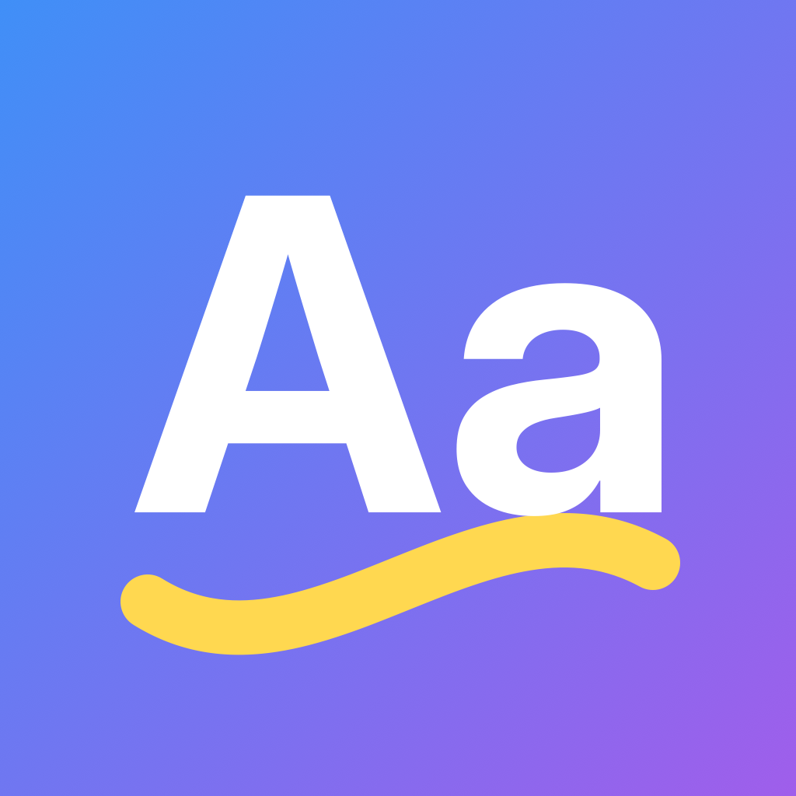
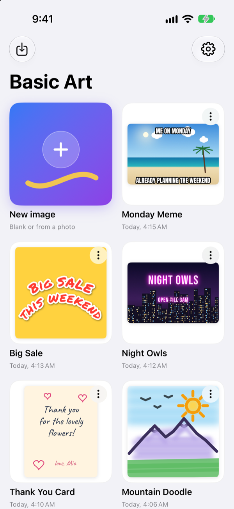
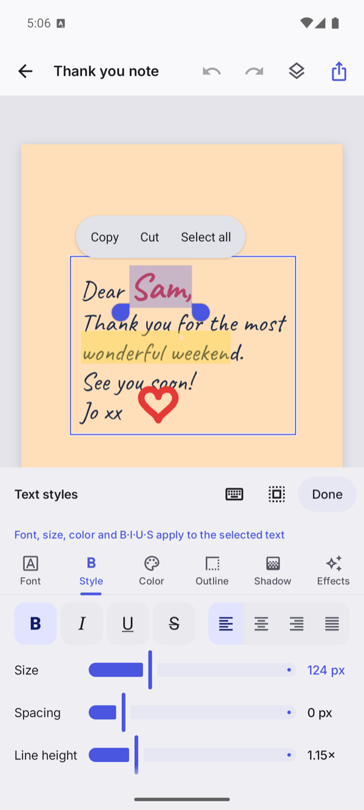
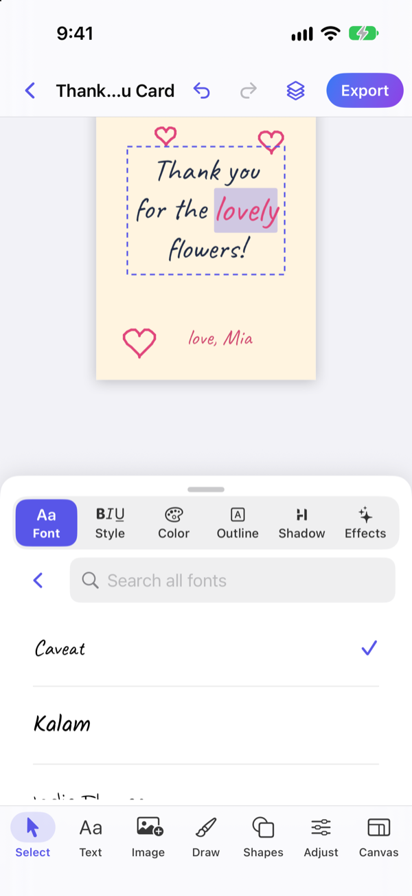
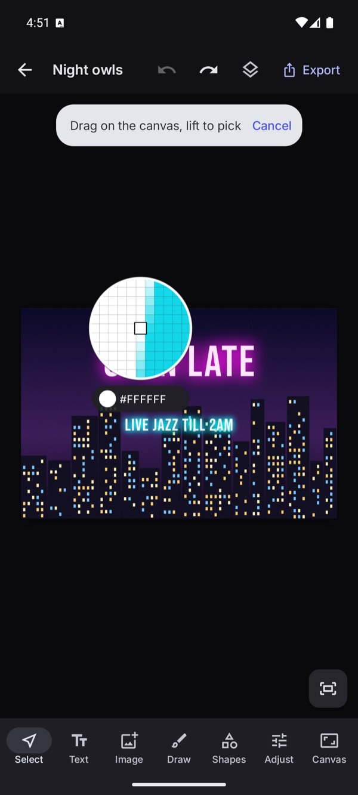
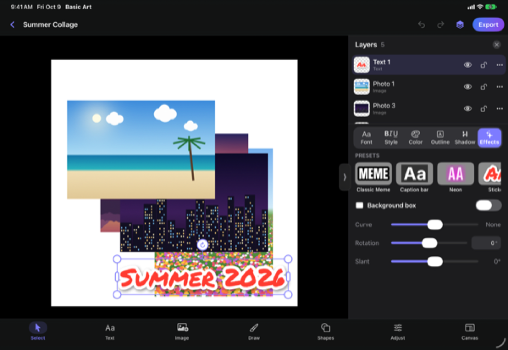
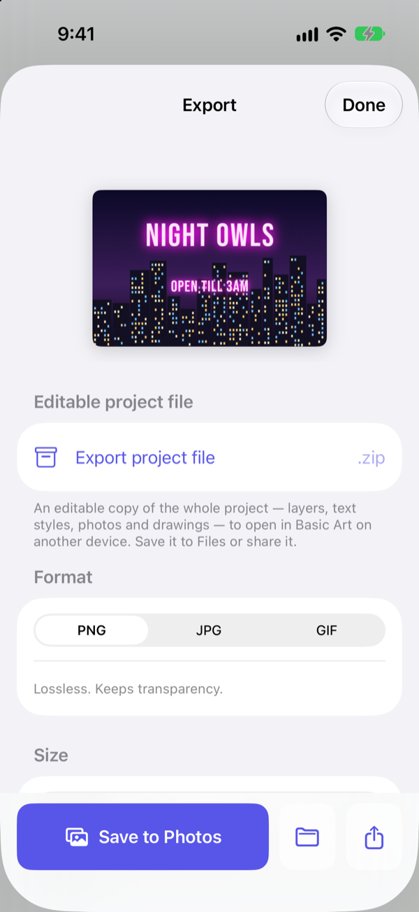

<p align="center">
  
</p>

<h1 align="center">Basic Art</h1>

<p align="center"><strong>Basic Art — a simple, basic art editing tool.</strong></p>

<p align="center">No ads · No accounts · No internet · Simple.</p>

---

Basic Art is a fast, offline image editor for Android and iOS. Put great-looking text on a photo, make a meme, build a collage, or sketch something quick, then export it and get on with your day.

## Why it exists

Making a simple image shouldn't cost a subscription. Over time, art apps have gotten expensive and complicated, and many have become slow, dependent on an internet connection, and glitchy for the simple things most people actually want to do.

Basic Art is the opposite. It opens fast, works completely offline, stays stable, and produces professional-quality results. It does the simple things very well and gets the job done.

## Getting it

- **Google Play and the App Store: $0.99, once.** Store links are coming soon. You pay once and are never asked for money again. No in-app purchases, no subscriptions, and updates arrive automatically.
- **Source code: free, right here,** under the MIT license.
- **APK:** an Android APK is posted in [GitHub Releases](https://github.com/danavfrost/basicart/releases) from time to time. It may lag behind the store versions.
- **Build it yourself:** anyone can build Basic Art from source. See [Building](#building).

There are two Android APKs:

| File | For |
|---|---|
| `BasicArt.apk` | 64-bit devices (arm64-v8a, plus x86_64 for emulators). Almost every modern Android phone and tablet. |
| `BasicArt-32bit.apk` | Older 32-bit devices (armeabi-v7a). Use this only if the 64-bit APK won't install. |

Both require Android 8.0 or newer. The iOS app requires iOS 16 or newer.

### GitHub APKs vs. the Play Store: read this before installing

The APKs on GitHub and the Google Play version are **signed with different keys**, so Android treats them as different installs of the same app:

- **You can't update one with the other.** If you installed an APK from GitHub and later want the Play Store version (or the other way round), Android will refuse to install it over the top. You have to **uninstall the old one first**.
- **The current GitHub APKs (1.0.0) are signed with a development key.** A later GitHub release signed with the permanent release key won't install over them, so you'll need to uninstall 1.0.0 first.
- **Uninstalling deletes your projects.** Basic Art keeps projects only inside the app, so removing it removes them. Exported images in your Pictures folder are not affected.
- **Save your projects before you uninstall.** On the home screen, tap a project's **⋮ → Export project file** and save the `.zip` somewhere safe, such as Downloads. After installing the new version, tap **Import** and pick that file. Your layers, text and selections come back exactly as they were.
- The Play Store version updates itself automatically. GitHub APKs never update automatically; check the [Releases](https://github.com/danavfrost/basicart/releases) page for new ones.

## Features

**Text tool (the headline feature)**
- 265 bundled, open-licensed font families in 17 groups, from clean sans and book serifs to meme, handwriting, marker, retro pixel and stencil
- Font browser with every name drawn in its own font, plus search and recently used
- **B · I · U · S** on just the selected text, or the whole box
- Outline (solid, double or glow), drop shadow, solid or gradient fill
- Background box, curved / arched text, any rotation, letter spacing and line height
- One-tap presets: Classic Meme, Caption bar, Neon, Sticker, Retro and Handwritten note

**Layers**
- Image, text, drawing and shape layers
- Drag to reorder, show/hide, lock, duplicate, rename
- Move, scale and rotate on the canvas with snapping guides

**Drawing**
- Seven brushes: pen, marker, highlighter, airbrush, pencil, calligraphy and eraser
- The eraser works on any layer, and it's non-destructive and undoable

**Photos**
- Import one or many photos at once (great for collages), or start a project from a photo
- Crop, rotate, flip, brightness, contrast, saturation and warmth

**Shapes and colors**
- Rectangle, rounded rectangle, ellipse, line and arrow
- Preset palettes, recent and saved colors, HSV / HEX / RGB picker with opacity, and an eyedropper

**Export**
- PNG (with transparency), JPG and GIF at full resolution or scaled down
- Save to the device or share

**Everywhere**
- Light and dark themes
- Phones and tablets, portrait and landscape
- Autosave and full undo / redo

## Screenshots

<table>
  <tr>
    <td align="center"><br>Home</td>
    <td align="center"><br>Text tool</td>
    <td align="center"><br>Font browser</td>
  </tr>
  <tr>
    <td align="center"><br>Eyedropper</td>
    <td align="center"><br>Tablet, dark theme</td>
    <td align="center"><br>Export</td>
  </tr>
</table>

## Building

Basic Art is two native apps built from one spec ([`specs.md`](specs.md)): Kotlin + Jetpack Compose on Android, and Swift + SwiftUI on iOS. Both read the same project format and bundle the same fonts, palettes and presets from `shared/`.

### Android

Requirements: JDK 17 and the Android SDK (compile SDK 36). Android Studio works too. Just open the `android/` folder.

```sh
# Build both APKs and the store bundle
./android/build-apks.sh
```

This writes:

- `BasicArt.apk` (64-bit) and `BasicArt-32bit.apk` (32-bit) to the repository root
- the AAB to `android/app/build/outputs/bundle/release/app-release.aab`

Release builds are signed with the Android debug key until a release signing key is configured. They install fine, but see [GitHub APKs vs. the Play Store](#github-apks-vs-the-play-store-read-this-before-installing) about updating.

Run the unit tests (including the shared cross-platform fixtures):

```sh
cd android
./gradlew test
```

Instrumented UI tests run on one connected device or emulator: `ANDROID_SERIAL=<serial> ./gradlew connectedAndroidTest` (device tasks refuse to run without `ANDROID_SERIAL`, so they never hit every attached device).

### iOS

Requirements: Xcode 27 and [XcodeGen](https://github.com/yonaskolb/XcodeGen).

```sh
brew install xcodegen
cd ios
xcodegen generate
open BasicArt.xcodeproj
```

Then pick an iPhone or iPad simulator and press Run. To run on a real device, choose your own development team under Signing & Capabilities.

`ios/project.yml` is the source of truth for the Xcode project. Re-run `xcodegen generate` after changing it or adding files.

Run the unit and UI tests from the command line:

```sh
cd ios
xcodebuild test -project BasicArt.xcodeproj -scheme BasicArt \
  -destination 'platform=iOS Simulator,name=iPhone 17'
```

Swap in any simulator you have installed (`xcrun simctl list devices`). Tests that write renders or cross-platform exchange files put them in a `basicart-tests` folder in the temp directory; set `TEST_RUNNER_BASICART_TEST_OUT=<dir>` to choose another folder.

## Repository layout

```
android/        Android app (Kotlin, Jetpack Compose) and build-apks.sh
ios/            iOS app (Swift, SwiftUI); project.yml generates the Xcode project
shared/         Used by both apps
  FORMAT.md       Project file format (plus project.schema.json)
  fixtures/       Cross-platform test projects both apps must load identically
  fonts/          Bundled font families, each with its license, and CREDITS.md
  palettes/       Preset color palettes
  presets/        Text presets (Classic Meme, Neon, ...)
  branding/       App icon sources
  tools/          Fixture generator and validator scripts
docs/           Screenshots and other documentation assets
specs.md        The product specification
PRIVACY.md      Privacy policy
LICENSE         MIT license
```

## Privacy

Basic Art collects no data and never connects to the internet. The Android app doesn't request the internet permission at all. There are no ads, analytics, crash reporting or accounts. Projects stay in the app's private storage on your device. Read the full [privacy policy](PRIVACY.md).

## License

The Basic Art source code is released under the [MIT License](LICENSE).

The fonts bundled in [`shared/fonts`](shared/fonts) are not covered by the MIT license. Each family keeps its own license, either the SIL Open Font License 1.1 or the Apache License 2.0, and its license file ships next to the font files. See [`shared/fonts/CREDITS.md`](shared/fonts/CREDITS.md).

## Credits

Basic Art is made by Dana Vaughne Frost.

Fonts are the work of their designers and are bundled unmodified from the Google Fonts collection. The full list of families, designers, licenses and sources is in [`shared/fonts/CREDITS.md`](shared/fonts/CREDITS.md), and the same credits appear in the app under **Settings → Licenses & Credits**.

Found a bug or have an idea? [Open an issue](https://github.com/danavfrost/basicart/issues).
